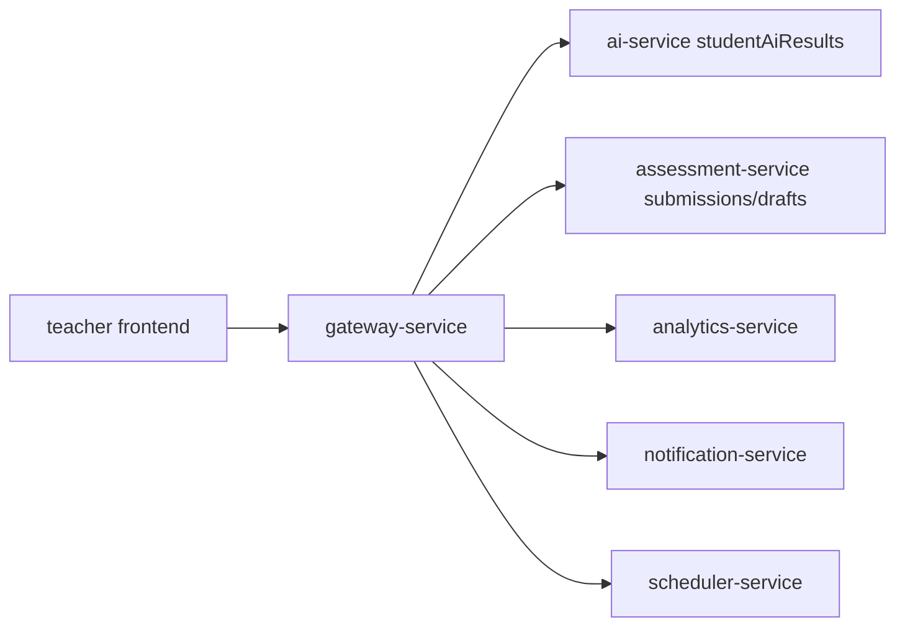

# v10 架构变化

教师端联动通过 Gateway 聚合：

```mermaid
flowchart LR
  TeacherClient["teacher frontend"] --> Gateway["gateway-service"]
  Gateway --> AI["ai-service studentAiResults"]
  Gateway --> Assessment["assessment-service submissions/drafts"]
  Gateway --> Analytics["analytics-service"]
  Gateway --> Notification["notification-service"]
  Gateway --> Scheduler["scheduler-service"]
```

教师只读学生 AI 过程证据；干预通过 notification/scheduler 发送，不改写学生历史。

