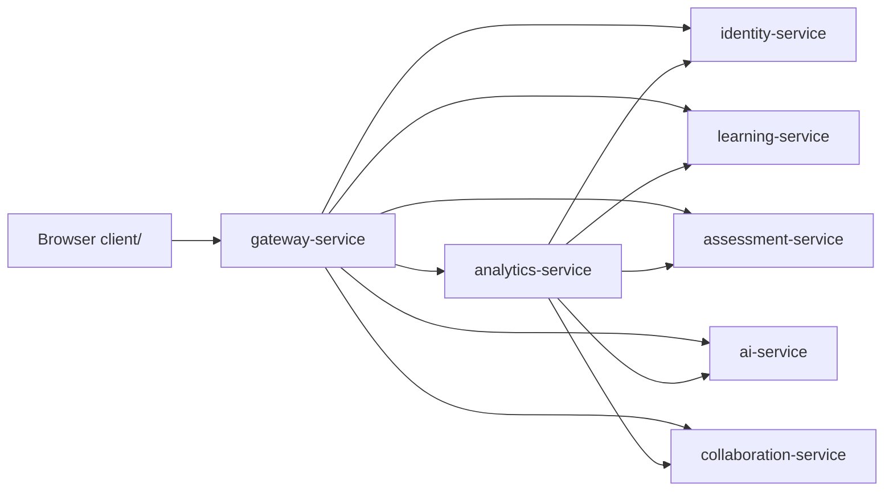

# v5 架构变化

## 变化摘要

v5 将 analytics-service 从健康检查服务扩展为跨服务只读聚合服务，并把 `client/` 作为 Gateway 托管的主前端继续完善。

## analytics-service 职责

- 读取用户、课程、学习、评测、协作、AI 提供者状态。
- 计算面向 dashboard 和教师工作台的统计结果。
- 提供只读 API，不拥有业务写模型。
- 不保存核心业务数据，v5 默认不新增 `data/analytics.json`。

## Gateway 职责变化

- 新增 analytics-service client。
- 新增 `/api/analytics/*` 代理。
- `/api/dashboard` 聚合 analytics overview。
- 继续托管 `client/` 静态资源。

## 前端职责变化

当前前端已有登录、总览、学习、AI、协作视图。v5 扩展为：

- 学生：总览、学习、AI、协作、评测、错题。
- 教师：总览、学习、AI、协作、评测管理、统计。
- 共用同一套 `ApiClient`、`Store` 和 DOM 渲染方式。

## 服务边界

analytics-service 只读聚合下游服务：

- identity-service：用户列表、用户快照、角色。
- learning-service：课程、目标、任务、笔记、学习上下文。
- assessment-service：作业、提交、练习、错题、掌握度、内部 dashboard/context。
- collaboration-service：活动日志。
- ai-service：provider health。

assessment-service 继续负责评测写模型，analytics-service 不反向写 assessment 数据。

## 失败处理

- Gateway 调用 analytics 失败时，`/api/dashboard` 可保留 v4 字段，并在 `meta.analyticsStatus` 标记 `down`。
- analytics-service 调用单个下游失败时，整体统计接口返回 502，错误 `DOWNSTREAM_ERROR`，测试中可覆盖降级路径。
- 前端显示空状态或错误提示，不出现未捕获异常导致白屏。

