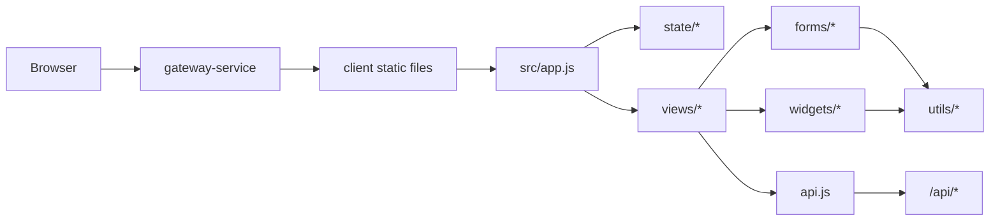

# v6 架构变化

## 变化摘要

v6 不改变后端服务边界，主要改变前端内部结构。现状是 `app.js` 与 `components.js` 承担过多职责；v6 将其拆成页面、表单、部件、状态、工具五层。



## 前端分层

| 层 | 职责 | 示例 |
| --- | --- | --- |
| `app.js` | 启动、路由、全局事件、刷新编排 | `handleClick`、`handleSubmit`、`render` |
| `api.js` | Gateway API 封装 | `createQuestion`、`updateAssignment` |
| `state/` | 初始状态、选择器、视图状态 | `selectCanManageAssessment` |
| `views/` | 页面级渲染 | `assignmentManageView(state)` |
| `forms/` | 表单 HTML 与 payload 解析 | `assignmentForm(...)` |
| `widgets/` | 可复用展示部件 | `dataTable(...)`、`masteryBars(...)` |
| `utils/` | 无状态工具 | `escapeHtml`、`formatDate`、`required` |

## app.js 目标形态

`app.js` 不再保存大段页面模板。目标是将页面渲染和事件处理委托给模块：

```js
import { ApiClient } from "./api.js";
import { createInitialState } from "./state/appState.js";
import { Store } from "./state/viewState.js";
import { routeTable, titleFor, subtitleFor } from "./views/routeTable.js";
import { readFormData } from "./utils/dom.js";
import { showToastPatch, withSavingPatch } from "./state/selectors.js";

export class EduMindApp {
  constructor(root) {
    this.root = root;
    this.api = new ApiClient();
    this.store = new Store(createInitialState());
    this.events = null;

    this.store.subscribe(() => this.render());
    this.root.addEventListener("click", (event) => this.handleClick(event));
    this.root.addEventListener("submit", (event) => this.handleSubmit(event));
    this.root.addEventListener("change", (event) => this.handleChange(event));
    this.root.addEventListener("input", (event) => this.handleInput(event));
  }

  async start() {
    if (!this.api.token) {
      this.renderLogin();
      return;
    }
    await this.loadSession();
  }

  render() {
    const state = this.store.get();
    if (!state.user) {
      this.renderLogin();
      return;
    }

    const route = routeTable[state.route] || routeTable.dashboard;
    this.root.innerHTML = route.layout({
      state,
      title: titleFor(state.route),
      subtitle: subtitleFor(state.route, state.user),
      content: route.view(state)
    });
  }

  async runAction(action, detail = {}) {
    const handlers = {
      "route": () => this.navigate(detail.route),
      "refresh": () => this.refreshCurrentRoute(),
      "select-assignment": () => this.selectAssignment(detail.id),
      "edit-assignment": () => this.openAssignmentEditor(detail.id),
      "delete-question": () => this.deleteQuestion(detail.id),
      "start-practice": () => this.startPractice(detail.bankId),
      "finish-practice": () => this.finishPractice(detail.sessionId),
      "view-student": () => this.loadStudentProfile(detail.id)
    };

    if (!handlers[action]) {
      return;
    }
    await handlers[action]();
  }
}
```

## 目标状态结构

```js
export function createInitialState() {
  return {
    route: "dashboard",
    user: null,
    provider: "",
    toast: null,
    loading: {
      session: false,
      dashboard: false,
      assignments: false,
      questionBanks: false,
      practice: false,
      analytics: false,
      settings: false
    },
    saving: {
      assignment: false,
      grading: false,
      questionBank: false,
      question: false,
      practiceAnswer: false,
      profile: false
    },
    errors: {},
    filters: {
      assignments: { status: "", courseId: "", keyword: "" },
      questionBanks: { courseId: "", keyword: "", type: "" },
      practice: { courseId: "", bankId: "", status: "" },
      analytics: { courseId: "", studentId: "" }
    },
    selected: {
      assignmentId: "",
      questionBankId: "",
      questionId: "",
      practiceSessionId: "",
      studentId: ""
    },
    dashboard: null,
    activity: [],
    assessment: {
      assignments: [],
      assignmentDetail: null,
      rubrics: [],
      questionBanks: [],
      questions: [],
      mistakes: [],
      practiceSession: null,
      practiceHistory: []
    },
    analytics: {
      overview: null,
      teacher: null,
      selectedCourse: null,
      selectedStudent: null
    },
    settings: {
      health: null,
      modelConfig: null
    }
  };
}
```

## 模块依赖规则

- `views/*` 可以依赖 `forms/*`、`widgets/*`、`utils/*`。
- `forms/*` 只能依赖 `widgets/*` 中的基础输入部件和 `utils/*`。
- `widgets/*` 不能依赖具体页面。
- `utils/*` 不能依赖 `api.js`、`store.js` 或 DOM 全局状态。
- `state/*` 不能发请求，只做数据组织和选择器。
- `api.js` 不依赖任何视图模块。

## 路由表示

v6 继续使用内存路由，不引入路由库。可选地同步 URL hash，便于刷新后恢复页面。

```js
export const routeTable = {
  dashboard: { label: "总览", view: dashboardView, roles: ["student", "teacher", "admin"] },
  learning: { label: "学习", view: learningView, roles: ["student", "teacher", "admin"] },
  assignments: { label: "作业", view: assignmentManageView, roles: ["student", "teacher", "admin"] },
  "question-banks": { label: "题库", view: questionBankManageView, roles: ["teacher", "admin"] },
  practice: { label: "练习", view: practiceView, roles: ["student", "teacher", "admin"] },
  analytics: { label: "统计", view: analyticsView, roles: ["teacher", "admin"] },
  ai: { label: "AI", view: aiView, roles: ["student", "teacher", "admin"] },
  team: { label: "协作", view: teamView, roles: ["student", "teacher", "admin"] },
  settings: { label: "设置", view: settingsView, roles: ["student", "teacher", "admin"] }
};
```

## 样式架构

v6 可继续单文件 `styles.css`，但按块组织：

```css
/* 1. tokens */
/* 2. reset/base */
/* 3. shell/navigation */
/* 4. layout grids */
/* 5. widgets: cards/tables/charts/forms/toasts */
/* 6. pages: assignments/question-banks/practice/analytics/settings */
/* 7. responsive */
/* 8. reduced motion */
```

## 失败处理

- API 请求失败写入 `state.errors[scope]`，页面显示 `errorPanel`。
- 页面局部失败不能让整个 app 白屏。
- 提交失败后保留用户输入。
- 评分和 AI 初评失败显示可重试操作。
- 健康检查失败时设置页显示 down 状态，不影响其他页面使用。

