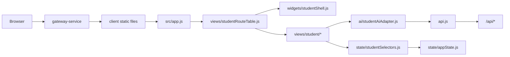

# v7 第一阶段架构变化

## 变化摘要

v7 第一阶段不改变后端服务边界，主要在前端增加学生端 AI-first 应用层。相比 v6 的通用工作台，v7 增加 student shell、student views、student selectors 和 AI adapter。



## 新增前端目录建议

```text
client/src/
  ai/
    studentAiAdapter.js
    studentPrompts.js
    studentAiSchemas.js
  state/
    studentSelectors.js
  views/
    student/
      studentAiView.js
      studentAiInsightView.js
      studentLearningView.js
      studentTaskDetailView.js
      studentAssignmentsView.js
      studentAssignmentDetailView.js
      studentSubmitView.js
      studentAssignmentHistoryView.js
      studentFeedbackView.js
      studentSubmitPreviewView.js
      studentSubmitSuccessView.js
      studentPracticeView.js
      studentPracticeSessionView.js
      studentPracticeResultView.js
      studentMistakeDetailView.js
      studentNotesView.js
      studentNoteEditorView.js
      studentNoteAiResultView.js
  widgets/
    studentShell.js
    studentAiPanel.js
    studentActionCards.js
    studentBottomNav.js
  forms/
    studentSubmissionForm.js
    studentTaskDraftForm.js
    studentNoteForm.js
```

## Student Shell

学生端 shell 与 v6 通用 dashboard shell 可并存。学生端 shell 负责：

- 桌面左侧一级导航。
- 移动端顶部栏和底部导航。
- 主内容区。
- 右侧 AI 上下文助手。
- 详情页返回上级页面。

一级入口固定为：

```js
export const STUDENT_PRIMARY_ROUTES = [
  { route: "student-ai", label: "AI 学习台", icon: "sparkles" },
  { route: "student-learning", label: "学习", icon: "book-open" },
  { route: "student-assignments", label: "作业", icon: "clipboard-list" },
  { route: "student-practice", label: "练习与错题", icon: "target" },
  { route: "student-notes", label: "课程笔记", icon: "notebook" }
];
```

## Student State 增量

在现有 `createInitialState()` 上增加学生端状态：

```js
student: {
  routeStack: [],
  ai: {
    dailyPlan: null,
    weaknessInsight: null,
    assignmentGuide: null,
    submissionCheck: null,
    noteOrganizeResult: null,
    lastCommand: null
  },
  learning: {
    selectedCourseId: "",
    selectedTaskId: "",
    taskDrafts: []
  },
  assignments: {
    mode: "course",
    selectedAssignmentId: "",
    selectedSubmissionId: "",
    submitDraft: {
      assignmentId: "",
      content: "",
      attachmentsText: ""
    },
    lastSubmission: null
  },
  practice: {
    selectedBankId: "",
    selectedSessionId: "",
    focusedQuestionIndex: 0,
    result: null
  },
  notes: {
    selectedCourseId: "",
    selectedNoteId: "",
    editorDraft: {
      title: "",
      content: "",
      tags: ""
    }
  }
}
```

## AI Adapter 架构

本阶段不在视图里直接写 prompt。所有 AI-first 能力通过 `StudentAiAdapter` 调用：

```js
const adapter = new StudentAiAdapter({ api });
const result = await adapter.buildDailyPlan(selectStudentAiContext(state, "student-ai"));
```

短期 fallback：

- `buildDailyPlan` 可用 `/api/ai/ask`。
- `draftLearningTask` 可用 `/api/ai/ask`，生成结构化草稿后只进入前端 draft。
- `guideAssignment` 可用 `/api/ai/ask`。
- `checkSubmissionDraft` 可用 `/api/ai/ask`。
- `organizeNote` 可优先用 `/api/ai/summarize`，再在前端组装 cards/paragraphs fallback。

长期替换：

- 后端新增 `student-ai-service` 或在 `ai-service` 内新增 student chain routes。
- Adapter 方法保持不变，只替换内部请求路径。

## Prompt 和 LangChain 约束

Prompt 文件只定义：

- system prompt。
- input schema。
- output schema。
- few-shot 示例。
- fallback 规则。

输出必须是 JSON-compatible object。前端不得要求模型输出 HTML。

LangChain 目标形态：

```js
const chain = prompt.pipe(model).pipe(structuredOutputParser);
```

## 失败处理

- AI adapter 失败时返回结构化 fallback，不让页面白屏。
- 作业提交失败保留提交草稿。
- 练习答题失败保留当前题号和本地答案。
- 笔记保存失败保留编辑草稿。
- 详情页缺少 selected id 时返回对应一级页面。

