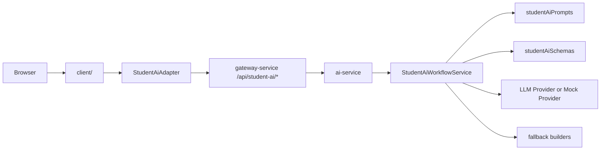

# v8 架构变化

## 变化摘要

v8 将 v7 的前端 `StudentAiAdapter` fallback 能力下沉到后端 `ai-service`，并通过 Gateway 暴露为 `/api/student-ai/*`。



## 后端新增模块建议

```text
services/ai-service/src/
  application/
    studentAiWorkflowService.js
    studentAiPrompts.js
    studentAiSchemas.js
    studentAiFallbacks.js
```

也可以把 prompt/schema/fallback 放在一个文件中，但必须保持职责清晰。

## StudentAiWorkflowService

目标方法：

```js
export class StudentAiWorkflowService {
  async buildDailyPlan(user, input) {}
  async buildWeaknessInsight(user, input) {}
  async draftTask(user, input) {}
  async guideAssignment(user, input) {}
  async checkSubmission(user, input) {}
  async organizeNote(user, input) {}
}
```

每个方法必须：

- 校验用户已登录。
- 规范化 input。
- 构建 prompt。
- 调用 provider。
- 尝试解析 JSON。
- normalize 输出 schema。
- provider 失败或 JSON 失败时使用 fallback。
- 返回 `provider`、`generatedAt`、`rawText`。

## Provider 使用策略

本阶段复用现有 `ai-service` provider：

- mock provider：普通测试默认使用。
- lmstudio/openai-compatible provider：保留配置能力，不要求普通测试调用。

不得新增外网依赖。

## Gateway 代理

`gateway-service` 增加代理：

```js
router.post("/api/student-ai/daily-plan", ...)
router.post("/api/student-ai/weakness-insight", ...)
router.post("/api/student-ai/task-drafts", ...)
router.post("/api/student-ai/assignment-guide", ...)
router.post("/api/student-ai/submission-check", ...)
router.post("/api/student-ai/note-organize", ...)
```

所有请求都带用户上下文 headers。

## 前端 Adapter 调整

v7：

```js
StudentAiAdapter -> /api/ai/ask -> parse/fallback
```

v8：

```js
StudentAiAdapter -> /api/student-ai/* -> schema result
                -> fallback to local builder on failure
```

方法签名不变，页面不需要感知后端迁移。

## LangChain 预留形态

本阶段代码可以不安装 LangChain，但结构按 chain 思路组织：

```js
const prompt = buildPrompt(input);
const raw = await provider.complete(prompt);
const parsed = parseStructuredJson(raw);
return normalize(parsed, fallback(input));
```

未来可替换为：

```js
const chain = promptTemplate.pipe(model).pipe(structuredOutputParser);
```

## v7 遗留修复架构点

### 默认路由

当用户角色是 student 且 hash 为空或 hash 为旧 `dashboard` 默认值时，启动路由应为 `student-ai`。

### 文本转义

student views 中：

- 文本节点使用 `escapeHtml(value)`。
- attribute 使用 `attr(value)`。
- 数字显示先 `String()` 再转义。
- AI `rawText` 默认不展示。

