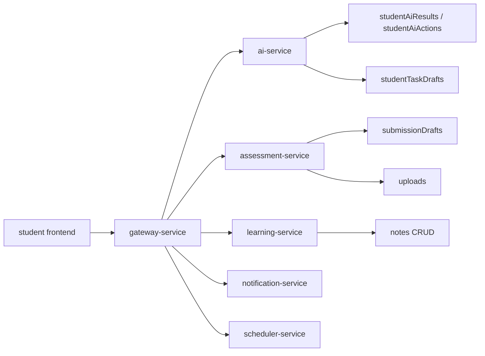

# v9 架构变化

## 变化摘要

v9 在 v8 AI workflow 基础上增加“学生记忆层”：AI 结果、行动、草稿、上传、笔记、通知和时间线。

## 服务所有权

| 能力 | 所属服务 | 理由 |
| --- | --- | --- |
| AI 结果与行动 | ai-service | 由 AI workflow 生成和解释 |
| AI 任务草稿 | ai-service | 生成结果，确认时调用 learning-service |
| 提交草稿 | assessment-service | 与 assignment/submission 生命周期一致 |
| 上传文件 | assessment-service 或 gateway local upload | 作业提交附件优先 |
| 笔记 CRUD | learning-service | 笔记属于学习域 |
| 时间线 | Gateway 聚合或 ai-service 聚合 | 面向学生端展示 |

## 前端变化

- `StudentAiAdapter` 读取最近 AI result。
- AI action card 增加状态按钮。
- 提交页进入时加载后端草稿。
- 笔记页从真实 `GET /api/notes` 加载。
- AI 学习台增加时间线区域。
- 右侧 AI 面板显示最近结果和提醒。

## 失败处理

- AI result 保存失败不影响即时展示，但显示“未同步”状态。
- 上传失败不清空草稿。
- 草稿提交失败保留草稿状态。
- 时间线聚合失败不影响主页面。

